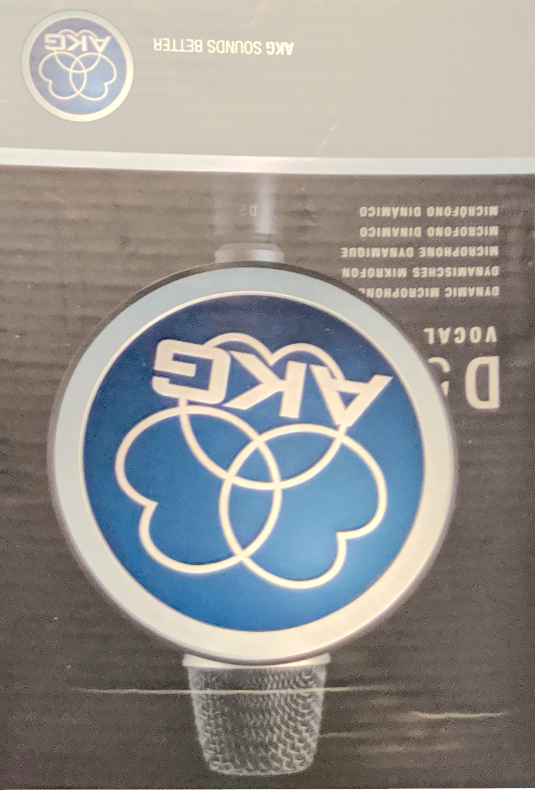
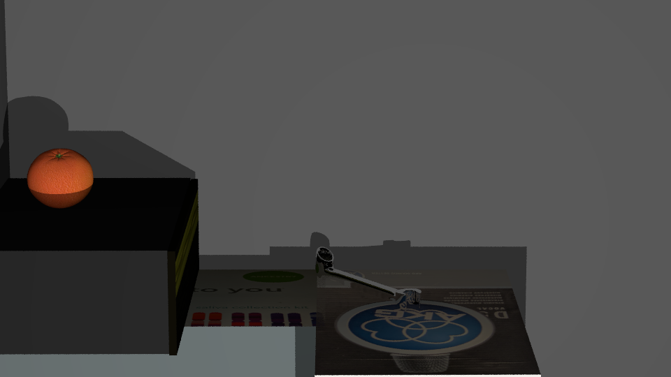

# Computer Graphics 2019 - Assignment 1

Qais Patankar - s1620208 - 2018-10-01

## PBRT

A 15" MacBook Pro was used for this assignment, meaning that we had to install PBRT on macOS.

We initially tried `brew install pbrt` to install pbrt, but Homebrew (the macOS package manager) had an old version of pbrt - _2.0.342_ to be exact.
This is outdated and we need to use [pbrt-v3](https://github.com/mmp/pbrt-v3) instead. We looked into updating the Homebrew formula to install v3 instead,
but since the pbrt-v3 project does not tag releases, the pbrt project is no longer eligible for inclusion in Homebrew.

Therefore, we uninstalled pbrt-v2 (`brew uninstall pbrt`) and then created [a GitHub issue](https://github.com/Homebrew/homebrew-core/issues/44781) to propose the removal of pbrt (v2) from Homebrew.

### Build pbrt

We primarily followed the instructions on the [README.md document](https://github.com/mmp/pbrt-v3/blob/master/README.md).

1. Clone the repository using the recommended `git clone --recursive https://github.com/mmp/pbrt-v3/`
2. Create a `build` directory: `mkdir pbrt-v3/build`
3. Change to the `build` directory: `cd pbrt-v3/build`
4. Generate a Makefile using: `cmake ..`. We don't need to provide any build flags, since the defaults (optimised release build) are perfectly appropriate.

    Copied from the README document:
    > By default, the makefiles that are created that will compile an optimized release build of pbrt. These builds give the highest performance when rendering, but many runtime checks are disabled in these builds and optimized builds are generally difficult to trace in a debugger.

5. Build pbrt-v3 by doing `make -j8`, where `8` is the number of logical cores on your machine.

After pbrt-v3 has been built you should be able to `ls` and see the following output:

```
➜ ls
CMakeCache.txt          CPackSourceConfig.cmake bsdftest                imgtool                 pbrt
CMakeFiles              CTestTestfile.cmake     cmake_install.cmake     libpbrt.a               pbrt_test
CPackConfig.cmake       Makefile                cyhair2pbrt             obj2pbrt                src
```

Note that the `pbrt` and `obj2pbrt`

### Install pbrt

Installing pbrt is as simple as adding your build folder to your `PATH` in `~/.bash_profile` (if you use `bash`).

If you use `sh`, you might need to add it to `~/.profile`. If you use `zsh`, it might be `~/.zprofile`.
If you use `oh-my-zsh` (with `zsh`), you can put it somewhere in `~/.oh-my-zsh/custom`.

1. Assuming you are still in the `build ` directory from the above instructions, type `pwd` and copy the output:

    ```
    ➜ pwd
    /Users/qaisjp/Documents/pbrt-v3/build
    ```

2. Navigate to your home folder and edit your profile` file, and add the following line, editing the path used as appropriate:

    ```
    export PATH="$PATH:/Users/qaisjp/Documents/pbrt-v3/build"
    ```

    When you are doing with using `pbrt-v3` you may remove this line from your PATH.

3. Restart your terminal and you should be able to type `obj2` and press `<tab>` to autocomplete to `obj2pbrt`.

    Test `pbrt --help` and `obj2pbrt --help` to ensure they work.

    **`pbrt --help`**
    ```
    ➜ pbrt --help
    usage: pbrt [<options>] <filename.pbrt...>
    Rendering options:
    --cropwindow <x0,x1,y0,y1> Specify an image crop window.
    --help               Print this help text.
    --nthreads <num>     Use specified number of threads for rendering.
    --outfile <filename> Write the final image to the given filename.
    --quick              Automatically reduce a number of quality settings to
                        render more quickly.
    --quiet              Suppress all text output other than error messages.

    Logging options:
    --logdir <dir>       Specify directory that log files should be written to.
                        Default: system temp directory (e.g. $TMPDIR or /tmp).
    --logtostderr        Print all logging messages to stderr.
    --minloglevel <num>  Log messages at or above this level (0 -> INFO,
                        1 -> WARNING, 2 -> ERROR, 3-> FATAL). Default: 0.
    --v <verbosity>      Set VLOG verbosity.

    Reformatting options:
    --cat                Print a reformatted version of the input file(s) to
                        standard output. Does not render an image.
    --toply              Print a reformatted version of the input file(s) to
                        standard output and convert all triangle meshes to
                        PLY files. Does not render an image.
    ```

    **`obj2pbrt --help`**
    ```
    ➜ obj2pbrt --help
    usage: obj2pbrt [--ptexquads] <OBJ filename> <pbrt filename>
    ```

If the test commands work, then pbrt has been successfully installed.

### Generating your own test image

In this section we test rendering an example scene from the command line.

1. If you are currently in the `pbrt-v3/build` folder, enter the main folder using `cd ..`
2. Enter the `scenes` folder: `cd scenes`
3. Enter `pbrt killeroo-simple.pbrt` to render the scene, this should create a new `killeroo-simple.exr` file.
4. Open this new file using `open killeroo-simple.exr`

You should get a photo like this:


## Approximate model of a scene, necessary to produce photorealistic synthetic objects

Below you can find the scene that will be modelled:


And the reproduced model:


We only intend to add models that affect or be affected by the three boxy objects in near the back of this cupboard.

### Accurate model of the real-world lighting as in the original photograph (10)

We initially added a light behind the camera using a point light (from the user guide).

```python
# Point lights emit in all directions evenly for a certain radius
AttributeBegin
    CoordSysTransform "camera"
    LightSource "point" "color I" [20 20 20]
AttributeEnd
```


This is good, but not good enough, so we added a spot light. The cone angle here is `5`,
just to demonstrate that lights indeed do work.


With a wider cone angle of `50` we achieved similar shadows as in the original scene:


Finally, after excessively tweaking `point from` and `point to`, we settled on this configuration:

```python
# Spot light emits something like a helicopter light
AttributeBegin
    LightSource "spot"
        "rgb I" [20 20 20]
        "float coneangle" [50]
        "point from" [-0.3 -3.35086012 -0.2]
        "point to" [0.378197998 0.34267801 -0.335577995]
AttributeEnd
```

Which produces something like this:


## Rendering synthetic object

### Choose a synthetic object model from a 3D model library (.ply files) (5)

We initially chose a measuring tape.

https://www.artec3d.com/3d-models/measuring-tape

It's something that would fit the area. It also has a reflective surface, and so.


Used limited dissolve to reduce vertex count https://blender.stackexchange.com/questions/31467/how-to-reduce-vertex-count-on-a-mesh

90 degrees was the value we used.

Due to limitations of the PBRT exporter we had to abandon this model.
TODO add picture

Instead we picked a metal nut

https://www.artec3d.com/3d-models/metal-nut

Still quite detailed, but can get away with a single Mirror texture.

Used the Decimate modifier.

Blender crashed a few times.

In the end we settled on the two following textures:
- [a fruit](https://free3d.com/3d-model/fruit-v1--195897.html)
- [a combination wrench](https://free3d.com/3d-model/combination-wrench-v1--661572.html)

 

The above two models and assosciated models and textures were taken from Free3D website.

### Render of synthetic scene with above parameters (5)

After placing all the objects, our render looks a bit like this:


In the annotated image above, observe the following changes to the scene:

1. Shadow from the black/green box appears on the superimposed orange.
2. Reflection of the 23andme box appears on combination wrench
3. Reflection of the box mic appears on the combination wrench
4. Shadow of combination wrench appears on cupboard wall.
    Also see `[!]` for shadow of orange appearing on cupboard wall.


## Compositing / Merging of synthetic objects on the real-world image

### Microphone box mistakes

At some point whilst cutting out the combination wrench we realised that we made a mistake with the microphone box texture.

Here was our original render:


And here is this area cut out from the original scene:


As you can see, in real life, the box is upside down.

Since this mistake doesn't really affect other objects as much, we decided to not start over. We just rerendered the image with the texture flipped, and cut it out again. We took this opportunity to modify the texture to be a little brighter, to match the original scene.

We also had to move the wrench a little bit so that it had slightly more interesting reflections.


After adjusting the exposure, our texture looked like this:



Here is our pbrt render with the microphone box fixed:




## Using pbrt is hard!

PBRT isn't very well supported and unfortunately the exporter does not support the latest version of Blender. We used Blender 2.7 instead of the much superior Blender 2.8.


We had to use the `pbrt` command line tool instead of just using one of Blender's default well-supported renderers (e.g. Blender). The `.pbrt` file output by the Blender did not export everything from Blender: a user would still have to manually recreate lighting as well as tweak the camera field of view.

We decided to automate the following edits:

- Edits to existing strings
- Inclusion of certain files

So we created a file `sceneplus.pbrt` in our project folder, and this contained exactly the following code:

```python
# Point lights emit in all directions evenly for a certain radius
AttributeBegin
    CoordSysTransform "camera"
    LightSource "point" "color I" [20 20 20]
AttributeEnd

# Spot light emits something like a helicopter light
AttributeBegin
    LightSource "spot"
        "rgb I" [20 20 20]
        "float coneangle" [50]
        "point from" [-0.3 -3.35086012 -0.2]
        "point to" [0.378197998 0.34267801 -0.335577995]
AttributeEnd

```

The newline at the end of the line is very important!

Our `Makefile` looked a little bit like this:

```bash
    sed 's/"integer pixelsamples" 4/"integer pixelsamples" ${SAMPLES}/' /tmp/scene.pbrt |\
	sed 's/Film "image"/Film "image" "string filename" "${OUTFILE}"/' |\
	sed 's/"float fov" \[24.56717103880224\]/"float fov" [10]/' |\
	sed 's/Integrator "path"/Integrator "directlighting" "string strategy" "all"/' |\
	sed '/WorldBegin/r sceneplus.pbrt'\
	> /tmp/scene.out.pbrt
```

If we break it down:

- Read in `/tmp/scene.pbrt`, and update the pixel samples using the `SAMPLES` environment variable.

    `sed 's/"integer pixelsamples" 4/"integer pixelsamples" ${SAMPLES}/' /tmp/scene.pbrt |\`
- Change the filename to the filename in the `OUTFILE` environment variable

    `sed 's/Film "image"/Film "image" "string filename" "${OUTFILE}"/' |\`
- Update the field of view from `24.*` to `10`

    `sed 's/"float fov" \[24.56717103880224\]/"float fov" [10]/' |\`
- Use a better integrator for improved lighting calculations

    `sed 's/Integrator "path"/Integrator "directlighting" "string strategy" "all"/' |\`
- Include `sceneplus.pbrt` after the `WorldBegin` directive

    `sed '/WorldBegin/r sceneplus.pbrt'\`
- Store the output of all that into `/tmp/scene.out.pbrt`

    `> /tmp/scene.out.pbrt`

The default variables set at the top of the Makefile are as follows:

```
SAMPLES ?= 10
OUTFILE ?= pbrt.png
```

We also included code in the `Makefile` to `rsync` all textures and models to a remote machine which has many more cores than our MacBook Pro. We configured it to only do this if `SAMPLES` was greater than or equal to `512`. It also copied the resultant file back to our local machine.

```bash
if [ ${SAMPLES} -ge 512 ]; then \
    rsync /tmp/scene.out.pbrt /tmp/mesh_*.ply /tmp/tex_*.png cluster:; \
    time ssh cluster pbrt-v3/build/pbrt scene.out.pbrt; \
    scp cluster:${OUTFILE} .; \
else \
    time pbrt /tmp/scene.out.pbrt; \
fi
```

Finally, our `Makefile` then just called `open ${OUTFILE}` so that we can inspect the build output.

Not needing to manually make edits repeatedly after every build allowed to us iterate rapdily.
