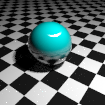
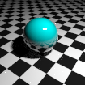
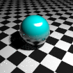
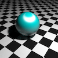
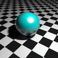
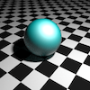
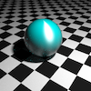
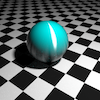

# Implementation <!-- (total 44) -->

## Poisson disk sampling <!-- (total 22) -->

### Dart-throwing Poisson disk sampling <!-- (5) -->

### Relaxed Poisson disk sampling <!-- (12) -->

### Example renderings (on one scene) depicting observable differences between Poisson disk sampling and any other (baseline) sampler <!-- (5) -->

## “anisotropic Phong BRDF” [3] <!-- (total 22) -->

### anisotropic Phong material <!-- (7) -->

### Importance sampling the anisotropic Phong material <!-- (9) -->

### Importance sampling <!-- (2) -->

Example renderings demonstrating the difference between rendering with and without importance sampling

### Different paramters <!-- (4) -->

Grid of renderings showcasing the behaviour of different parameters, similar to Figure 1 of [3]. An example .pbrt input file is provided at the end of the problem sheet. Crop the image as necessary to arrange in a grid.

|            | Nu = 10                         | Nu = 100                        | Nu = 1000                       | Nu = 10000                      |
|------------|---------------------------------|---------------------------------|---------------------------------|---------------------------------|
| Nv = 10000 |  |  |  |  |
| Nv = 1000  |  |  |  |  |
| Nv = 100   |  |  |  |  |
| Nv = 10    |  |  |  |  |
|            | Nu = 10                         | Nu = 100                        | Nu = 1000                       | Nu = 10000                      |

# Experimental evaluation <!-- (total 44) -->

## Qualitative comparison <!-- (12) -->

1 mark per sampler-integrator-scene image

## Convergence plots (12) (0.25 per sampler-integrator-scene combination convergence plot)

## Description, assessment and discussion of the results. This should include justification for why certain combinations appear better than others (20)

<!--
# Five-minute presentation (12)
-->
