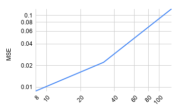
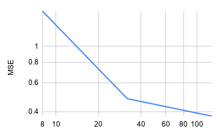
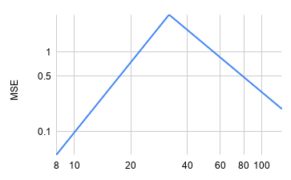
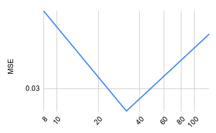

Scenes throughout this project have been procured and modified from [pbrt-v2](https://www.pbrt.org/scenes-v2.html).

# Implementation <!-- (total 44) -->

## Poisson disk sampling <!-- (total 22) -->

Implementing poisson disk sampling

### Dart-throwing Poisson disk sampling <!-- (5) -->

### Relaxed Poisson disk sampling <!-- (12) -->

### Example renderings (on one scene) depicting observable differences between Poisson disk sampling and any other (baseline) sampler <!-- (5) -->

\pagebreak

## Anisotropic Phong BRDF <!-- (total 22) -->

### Material <!-- (7) -->

Talk about creating the stuff, diffuse pipe whatever, sample_f

|  **first** | **second** | **third** |
|------------|------------|-----------|
|  |  |  ||

1. **first**: this has my initial implementation of `f`, and has the default `BxDF` implementation for `sample_f` and `pdf`.
2. **second**: this attempts to fix `f` by applying some techniques picked up from other material implementations, i.e. using `AbsCosTheta` as seen in `FresnelBlend::f`.
3. **third**: this final attempt has `sample_f` and `pdf` implemented

Whilst tweaking the implementation I came across renderings like the following:

|  |  |

\pagebreak

### Importance sampling <!-- (9) -->

The paper given (see _"Using the BRDF model in a Monte Carlo setting"_) gave us the formula for generating the `pdf` for a given half vector, leading our implementation to look like:

```cpp
Float AnphBxDF::Pdf(const Vector3f &wo, const Vector3f &wi) const {
    if (!importance) {
        return BxDF::Pdf(wo, wi);
    }
    auto h = Normalize((Normalize(wo) + Normalize(wi)) / 2);
    return (sqrt((Nu+1)*(Nv+1)) / (2 * Pi))
        * pow(
            AbsCosTheta(h),
            (Nu * Cos2Phi(h)) + (Nv * Sin2Phi(h))
        );
}
```

if `importance` is false (i.e. importance sampling disabled), we can fall back on the initial implementation of `pdf`.

This was extremely straightforward. As learned from `FresnelBlend::f`, we replace $n \cdot h$ with `AbsCosTheta(h)`.

### Differences with and without importance sampling <!-- (2) -->

<!--
Example renderings demonstrating the difference between rendering with and without importance sampling
-->

```python
Sampler "random" "integer pixelsamples" 50
Integrator "path" "integer maxdepth" [50]
Material "anph"
    "rgb Rd" [ 0.2 0.2 0.2 ] "rgb Rs" [ 0.2 0.2 0.2 ]
    "float nv" [100] "float nu" [10000.0]
    "bool importance" "true"
```

| **without**  (`"bool importance" "false"`) | **with** (`"bool importance" "true"`) |
|--------------------------------------------|---------------------------------------|
|          |        |

\pagebreak

### Different parameters <!-- (4) -->

<!--
Grid of renderings showcasing the behaviour of different parameters, similar to Figure 1 of [3]. An example .pbrt input file is provided at the end of the problem sheet. Crop the image as necessary to arrange in a grid.
-->

|            | Nu = 10                         | Nu = 100                        | Nu = 1000                       | Nu = 10000                      |
|------------|---------------------------------|---------------------------------|---------------------------------|---------------------------------|
| Nv = 10000 |  |  |  |  |
| Nv = 1000  |  |  |  |  |
| Nv = 100   |  |  |  |  |
| Nv = 10    |  |  |  |  |
|            | Nu = 10                         | Nu = 100                        | Nu = 1000                       | Nu = 10000                      |


\pagebreak

# Experimental evaluation <!-- (total 44) -->

## Qualitative comparison <!-- (12) -->

1 mark per sampler-integrator-scene image

\pagebreak

## Convergence plots <!-- (12 points) (0.25 per sampler-integrator-scene combination convergence plot) -->

For the following plots, rows are integrators with columns being samplers. Rendered using Google Sheets.

**Box**

| | halton | poisson | random | sobol
| ---- | ---- | ---- | ---- | --- |
| bdpt | { width=150px } | { width=150px } | { width=150px } | { width=150px } |
| path | { width=150px } | { width=150px } | { width=150px } | { width=150px } |
| whitted | { width=150px } | { width=150px } | { width=150px } | { width=150px } |

**Dragons**

| | halton | poisson | random | sobol
| ---- | ---- | ---- | ---- | --- |
| bdpt | { width=150px } | { width=150px } | { width=150px } | { width=150px } |
| path | { width=150px } | { width=150px } | { width=150px } | { width=150px } |
| whitted | { width=150px } | { width=150px } | { width=150px } | { width=150px } |

\pagebreak

**Killeroo3**

| | halton | poisson | random | sobol
| ---- | ---- | ---- | ---- | --- |
| bdpt | { width=150px } | { width=150px } | { width=150px } | { width=150px } |
| path | { width=150px } | { width=150px } | { width=150px } | { width=150px } |
| whitted | { width=150px } | { width=150px } | { width=150px } | { width=150px } |

**Teapot**


| | halton | poisson | random | sobol
| ---- | ---- | ---- | ---- | --- |
| bdpt | { width=150px } | { width=150px } | { width=150px } | { width=150px } |
| path | { width=150px } | { width=150px } | { width=150px } | { width=150px } |
| whitted | { width=150px } | { width=150px } | { width=150px } | { width=150px } |

\pagebreak

## Results

<!--
Description, assessment and discussion of the results. This should include justification for why certain combinations appear better than others (20)
-->

Generally the "dragons" scene produces inconsistent results.

<!--
# Five-minute presentation (12)
-->
